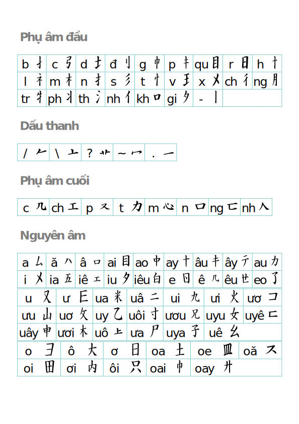
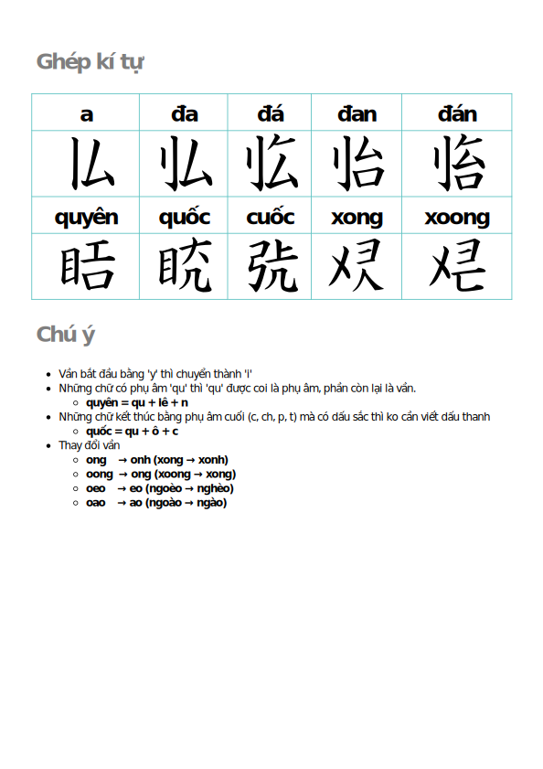

# Jaco Demo

==> [Demo](https://hajaulee.github.io/jaco)

==> [Bộ gõ](https://hajaulee.github.io/jaco/experience/ime.html)

## Extension

==> [Chrome Web Store](https://chromewebstore.google.com/detail/chuy%E1%BB%83n-ch%E1%BB%AF-vi%E1%BB%87t/podmifaaipikpganlbffdomeddkdadnk)

==> [Download extension](https://github.com/hajaulee/jaco/raw/refs/heads/main/extension.crx)

## Quy tắc

<!--  -->

## Ví dụ

### Tuyên ngôn độc lập

### Truyện kiều

## Tham khảo 
 
- https://github.com/ryanphung/chinese-hanviet-cognates
- http://nguyendu.com.free.fr/hanviet/

## Đóng góp
- Đóng góp từ hán việt tại: https://github.com/hajaulee/jaco/edit/main/resources/add-hanviet-own.txt
